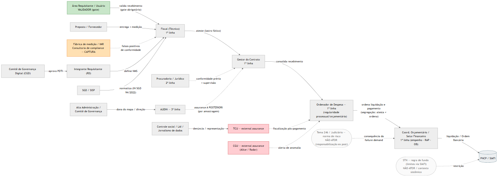
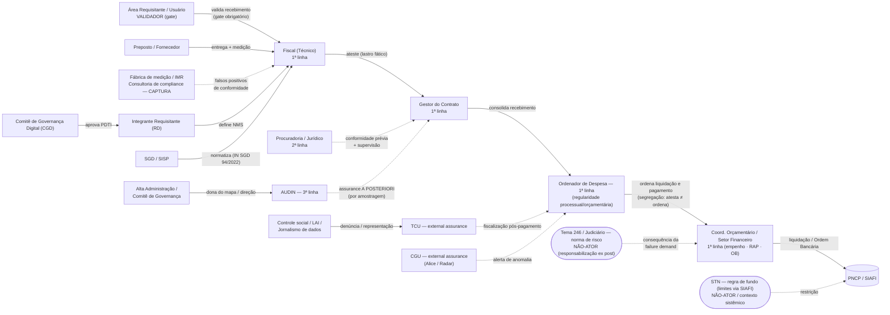

# Mapa de Atores (Final) — Ciclo de Vida de Licitações e Gestão de Contratos na APF

> **Formato B** — Diagrama Mermaid + tabela de atores.
> **Recorte:** Contratações/ateste (Lei 14.133/2021), coerente com `C_mapa_de_atores_v3.md`.
> **Consistência com o grill (rubrica):** *todos* os atores abaixo aparecem no transcript `C_grill_transcript.md` — a última coluna da tabela cita a rodada onde cada um surge. Atores **fora** do transcript foram deliberadamente **excluídos** para não quebrar a consistência (ex.: *Ordenador de Despesa*, *STN*, *STF* como nó isolado).
>
> *Nota:* o exemplo de Mermaid no enunciado (Cidadão→IVR→Roteador→Atendente) refere-se ao serviço da **URA/Seguro-Desemprego** (exercício 2.1 da aula02), que é outra jornada e cujos atores **não** constam do nosso grill. Por isso o diagrama abaixo usa os atores da jornada de contratações.

---

## Diagrama (Mermaid)

---

## Tabela de Atores (16 atores distintos)

| Ator | Tipo | Papel no ciclo (ateste/execução) | Aparece no grill |
|---|---|---|---|
| **Área Requisitante / Usuário** | Usuário direto / voz crítica (Núcleo) | **VALIDADOR com gate obrigatório**: valida o recebimento antes do ateste e da liquidação | R8 ("voz crítica interna / Área Requisitante"); R10 |
| **Fiscal (Técnico)** | Operador — 1ª linha | Afere IMR/NMS e propõe o ateste; dona do lastro *ex ante* | R7 ("fiscais que executam o controle"); R8 ("fiscal de TI atestar") |
| **Gestor do Contrato** | Operador/decisor — 1ª linha | Consolida o recebimento e atesta; é o objeto primário da análise de conformidade | R7; R9 ("O Gestor do Contrato é a 1ª linha executiva…") |
| **Ordenador de Despesa** | Decisor — 1ª linha | Autoridade máxima da execução orçamentária; ordena liquidação/pagamento. Garante a **regularidade processual/orçamentária** (não refaz o lastro técnico); responde solidariamente por vício formal evidente, falta de parecer obrigatório ou omissão grave. **Segregação dentro da 1ª linha: atesta ≠ ordena.** | R11 ("O Ordenador de Despesa pertence estritamente à 1ª Linha…") |
| **Coordenador Orçamentário / Setor Financeiro** | Operador — 1ª linha | Empenho, inscrição em RAP, liquidação e Ordem Bancária; é quem sofre a pressão do ponto F4 (fechamento de exercício) | R11 ("Traga o Coordenador Orçamentário/Setor Financeiro como um ator ativo…") |
| **Preposto / Fornecedor** | Fornecedor | Executa e mede; pressiona por continuidade (assimetria técnica) | R5 ("…Gestor e Fiscais de TIC, Preposto"); R9 ("fornecedor principal de tecnologia") |
| **Fábrica de medição / IMR (consultoria de compliance)** | Intermediário — **captura** | Terceiriza a medição; gera "falsos positivos de conformidade" | R8 ("Fábricas de Medição e Consultorias de IMR…") |
| **Integrante Requisitante (RD)** | Decisor de TIC | Define os Níveis Mínimos de Serviço (NMS) a fiscalizar | R2 e R5 ("Integrante Requisitante (RD)") |
| **Comitê de Governança Digital (CGD)** | Governança de TIC — 2ª linha | Aprova o PDTI; alinha o gasto de TI | R2 e R5 ("CGD") |
| **SGD / SISP** | Normatizador (TIC) | Normatiza o processo de contratação de TIC (IN SGD 94/2022) | R5 ("CGD, SGD/SISP, RD…") |
| **Procuradoria / Jurídico** | 2ª linha | Consultoria + conformidade legal prévia + riscos jurídicos | R7 ("separada da Procuradoria/Jurídico… atua como 2ª linha") |
| **AUDIN** | 3ª linha (assurance) | Avaliação independente, *a posteriori*, por amostragem baseada em risco | R7, R9 ("A AUDIN sob nenhuma hipótese pode ser a dona…") |
| **TCU** | External assurance | Controle externo; fiscalização/sanção pós-pagamento | R7 ("O controle externo (TCU)…") |
| **CGU** | External assurance | Controle interno central (sobreposição); malha fina Alice/Radar | R7 ("…e a CGU"); R9 ("auditoria (CGU/TCU)") |
| **Controle social / LAI / Jornalismo de dados** | Voz crítica externa | Rede descentralizada de auditoria contínua; materializa denúncias/representações | R8 ("Controle Social, LAI, Jornalismo de Dados") |
| **Alta Administração / Comitê de Governança** | Decisor / 2ª linha (direção) | **Dona institucional do mapa**; direção e mandato cruza-silos | R9 ("A Alta Administração (via Comitê de Governança)…") |

> **Tipos** seguem a tipologia da aula02 (usuário direto, operador, gestor/decisor, órgão de controle, fornecedor, intermediário, normatizador), cruzada com o **Modelo das Três Linhas** consolidado no grill.

---

## Não-atores (contexto), por decisão do grill (Rodada 11)

Estes aparecem no transcript mas foram **deliberadamente mantidos como contexto/regra de fundo**, não como atores ativos — e estão marcados como **NÃO-ATOR** no diagrama:

- **STN (Secretaria do Tesouro Nacional)** — "regra de fundo / restrição sistêmica" que dita limites via SIAFI; inseri-la como ator ativo poluiria o fluxo (R11).
- **STF / Judiciário (Tema 246)** — "norma/contexto de risco"; instância de responsabilização *ex post* quando o Modelo das Três Linhas falha, não uma linha de defesa nem etapa do processo (R11).

## Verificação de consistência (rubrica)

- **16 atores distintos** (mínimo exigido: 7). ✅
- **100% rastreáveis ao `C_grill_transcript.md`** — ver coluna "Aparece no grill". ✅
- **Ordenador de Despesa** e **Coordenador Orçamentário/Setor Financeiro** foram **introduzidos via Rodada 11** do grill — portanto entram sem quebrar a consistência.
- **Distinção atores × contexto:** STN e Judiciário/Tema 246 figuram apenas como **não-atores** (regra de fundo / norma de risco), por decisão expressa da Rodada 11 — o que mantém a rubrica satisfeita (todo *ator* do mapa está no grill) e ainda documenta o limite do recorte.
